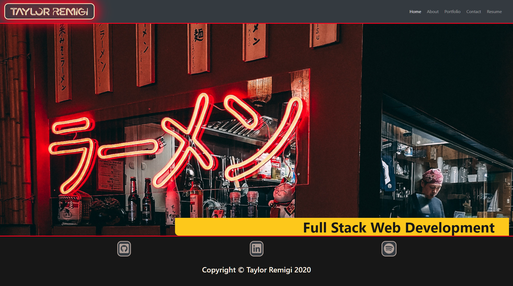

# React Portfolio 
[https://tremigi.github.io/portfolio/](https://tremigi.github.io/portfolio/)

## Description

This is a re-imagining of Taylor Remigi's professional web development portfolio utilizing React to render the front end. It features japanese neon inspirations and randomized flickering animations on the section titles.

## Table of Contents

* [Installation](#installation)
* [Usage](#usage)
* [Contributing](#contributing)
* [License](#license)
* [Testing](#testing)
* [Questions](#questions)

## Installation

Clone or download .zip file, navigate to root folder in command line, enter "npm i" to install dependencies.

## Usage 

Use links in navigation bar to view the various pages.

## License

This project is covered under the following license(s):

ISC

## Contributing

Open new issues from the issues page.

## Testing

N/A

## Questions

GitHub Profile: [TRemigi](https://github.com/TRemigi)

Reach me via email at <tayremigi@gmail.com>

